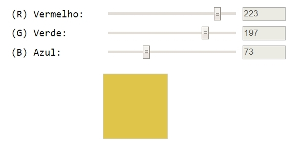

# Bootcamp-Full-Stack-IGTI-Maio-2020
# Trabalho prático Módulo 1

## Sobre

Projeto desenvolvido como trabalho para a bootcamp Full-Stack da IGTI 

## Instruções
Os alunos deverão desempenhar as seguintes atividades:

Implementar, através de HTML, CSS e JavaScript puro, uma aplicação que contenha três inputs do tipo “range”, cujos valores vão de 0 a 255 e representem, respectivamente, R (Red – Vermelho), G (Green – Verde) e B (Blue – Azul).
Essa combinação de valores deve ser utilizada para preencher a cor de fundo de uma quadrada.
Além disso, inclua três inputs de texto somente-leitura (desabilitados) para a visualização do valor atual de cada input do tipo range.
À medida em que o usuário modifica o valor dos ranges com as teclas ← e → do teclado, a  deve refletir a cor correspondente.
A imagem abaixo ilustra uma possível interface para a aplicação.

## Objetivos
Exercitar os seguintes conceitos trabalhados no Módulo:

 - Utilização de elementos HTML.

 - Utilização de CSS.

 - Utilização de identificadores em elementos HTML.

 - Captura de referência de elementos com JavaScript.

 - Manipulação de eventos com JavaScript.

 - Utilização de funções com JavaScript e CSS.

 - Manipulação direta de CSS com JavaScript.
## Exemplo

## Resultado Final

