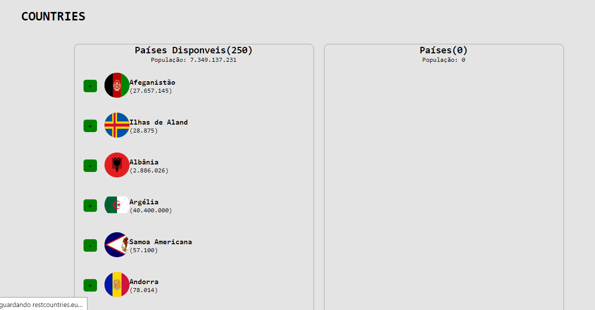

# Bootcamp Full-Stack IGTI 2020

## Sobre

   Esse exercício foi desenvolvido juntamente com o professor Rapahel Gomide nas aulas gravadas da IGTI.

## Objetivos

   Utilzar o Javascript para consumi uma API na qual trazia vários paises e suas respectivas população, praticar conceitos de async/await e manipular o CRUD com JavaScrip puro.

## Resultado

