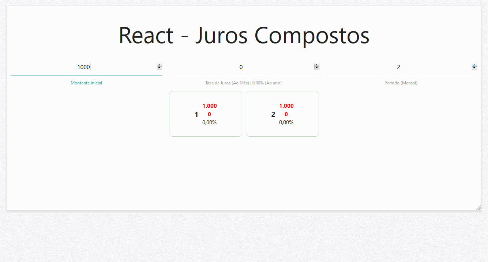

# Bootcamp Full-Stack IGTI Maio 2020
# Desafio Módulo 3

## Sobre

   Trabalho prosposto na bootcamp Full-Stack da IGTI.

   Criar uma aplicação com React, realizar cálculo de valorização/depreciação com base em um montante, taxa de juros mensal e quantidade de parcelas mensal, utilizando o conceito de juros compostos.

## Objetivos

Exercitar os seguintes conceitos trabalhados no Módulo:

 ✔ Implementação de algoritmos com JavaScript.

✔ Criação de componentes com React.

✔ Utilização de class components, functional components ou hooks.

## Resultado Final

This project was bootstrapped with [Create React App](https://github.com/facebook/create-react-app).

## Available Scripts

In the project directory, you can run:

### `yarn install`

Para instalar o projeto.

Install the project

### `yarn start`

Executa o aplicativo em modo de desenvolvolvimento.

Runs the app in the development mode. 
Open [http://localhost:3000](http://localhost:3000) to view it in the browser.

## Learn More

You can learn more in the [Create React App documentation](https://facebook.github.io/create-react-app/docs/getting-started).

To learn React, check out the [React documentation](https://reactjs.org/).

### Code Splitting

This section has moved here: https://facebook.github.io/create-react-app/docs/code-splitting

### Analyzing the Bundle Size

This section has moved here: https://facebook.github.io/create-react-app/docs/analyzing-the-bundle-size

### Making a Progressive Web App

This section has moved here: https://facebook.github.io/create-react-app/docs/making-a-progressive-web-app

### Advanced Configuration

This section has moved here: https://facebook.github.io/create-react-app/docs/advanced-configuration

### Deployment

This section has moved here: https://facebook.github.io/create-react-app/docs/deployment
