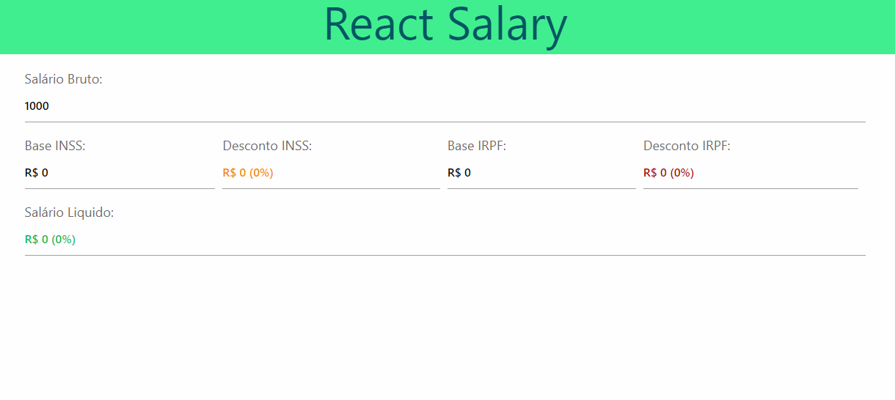

# Bootcamp Full-Stack IGTI Maio 2020
# Trabalho Prático Módulo 3

## Resultado Final

## Sobre

   Trabalho prosposto na bootcamp Full-Stack da IGTI.

   Construi uma aplicação utilizando React, para a calcular o salário líquido a partir do salário bruto, considerando as regras da CLT de 2020.

## Instruções
- 1 Implementação utilizando React, que possuirá um input editável e diversos outros inputs somente-leitura. Valores serem exibidos:
   
   - Salário bruto (editável pelo usuário).
   - Base INSS (somente-leitura).
   - Desconto INSS (somente-leitura).
   - Base IRPF (somente-leitura).
   - Desconto IRPF (somente-leitura).
   - Salário líquido (somente-leitura)

- 2 Utilizado preferencialmente os Class Components.

## Objetivos

Exercitar os seguintes conceitos trabalhados no Módulo:

 ✔ Implementação de aplicações com JavaScript e React

✔ Criação de Class Components

This project was bootstrapped with [Create React App](https://github.com/facebook/create-react-app).

## Available Scripts

In the project directory, you can run:

### `yarn install`

Para instalar o projeto.

Install the project

### `yarn start`

Executa o aplicativo em modo de desenvolvolvimento.

Runs the app in the development mode. 
Open [http://localhost:3000](http://localhost:3000) to view it in the browser.

